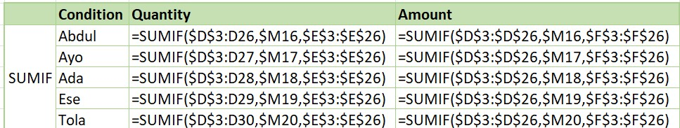
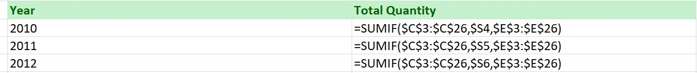
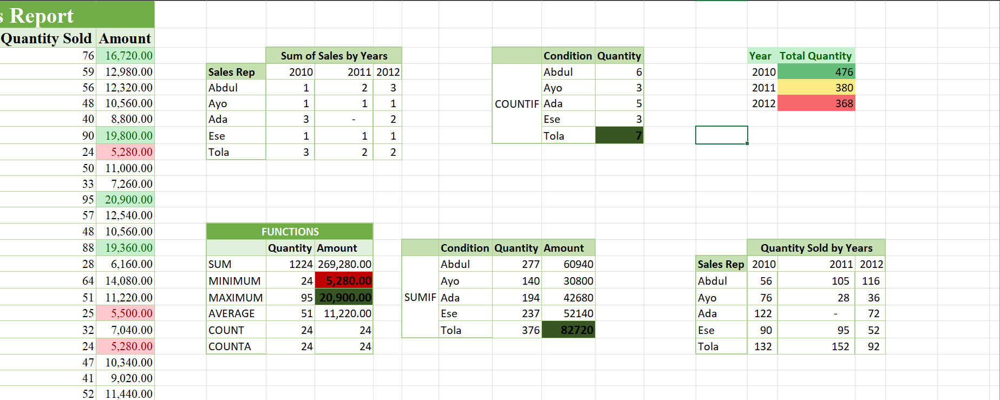

# Kabir Retail Solutions – Sales Analysis Report

## Executive Summary
Sales performance shows a declining trend over the three-year period, with total quantity sold decreasing from 476 in 2010 to 368 in 2012. This indicates a gradual reduction in business activity and suggests that the company may be facing performance challenges.

#Representative Performance

This table shows the number of transactions handled by each sales representative across the years.

## Yearly Sales Summary

The total quantity sold per year is as follows:

- 2010: 476
- 2011: 380
- 2012: 368

This shows a consistent decline in sales volume over time.

## Key Insights

- The highest transaction amount is **20,900**
- The lowest transaction amount is **5,280**
- The most active sales representative is Tola (7 transactions)
- The highest revenue-generating representative is Tola **82,720**

## Business Recommendations

### Efficiency

Tola has the highest number of transactions and also the highest revenue, indicating strong performance.
However, Abdul has a relatively high number of transactions (6) but generates less revenue compared to Tola. This suggests that Abdul may be handling more low-value sales.

### Recommendation:

- Encourage sales representatives to focus on higher-value transactions
- Provide training on upselling strategies

### Trend Analysis

Sales are clearly declining from 2010 to 2012:

- 2010 : 476
- 2011 : 380
- 2012 : 368

### Recommendation:

- The company should not immediately hire more staff in 2013
- Instead, focus on improving sales strategies, marketing, and efficiency

## Conclusion

The analysis reveals declining sales performance and highlights differences in sales representative efficiency. Addressing these issues can help improve revenue and overall business performance in future years.

